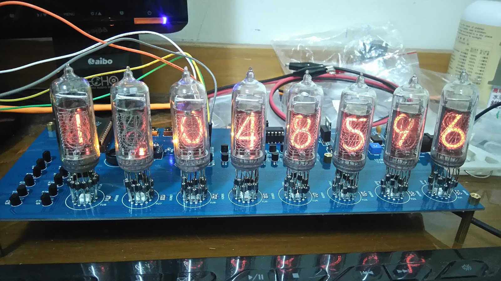

Nixie Clock
-----------

All data about my nixie tube implementation:

## The Nixie Clock

Some demo video:  
[Test Tube](https://www.youtube.com/watch?v=yUsdp3tUh6w)  
[Change WorldLine](https://www.youtube.com/watch?v=egiKm6L4Y-A)  

## Repository Structure
├── fig  
├── hardware  
│   ├── BOMmanual\_v1.0.1.csv : BOM file manually written  
│   ├── BOM\_v1.0.1.tsv : BOM file export from EasyEDA  
│   ├── layout  
│   │   ├── gerber\_v1.01 : v1.01 Gerber file  
│   │   └── gerber\_v1.02 : v1.02 Gerber file  
│   └── schematic : Schematic for [Altium](https://www.altium.com) and [EasyEDA](https://easyeda.com)  
└── software  
&emsp;&emsp;├── DS1309 : Set time into DS1309  
&emsp;&emsp;├── HC238test : Test 74HC238 works fine.  
&emsp;&emsp;├── HC4514test : Test 74HC4514 works fine.  
&emsp;&emsp;├── nixie : Source code that right now runs on my Nixie Clock  
&emsp;&emsp;├── pin1.01.h : Macro setting for v1.01 board
&emsp;&emsp;└── pin1.02.h : Macro setting for v1.02 board

## Usage
1. Order the hardware board using the Gerber file.
2. Buy materials according to BOM file.
3. The software, please copy pin\<version\>.h to pin.h inside each directory.

## CAUTION

* The BOM table may have some difference that I did not notice, please check before you order.
* v1.02 only draw on easyEDA, it does not get fabricated and tested. It might have design problem and cannot work normally. Use it carefully.
